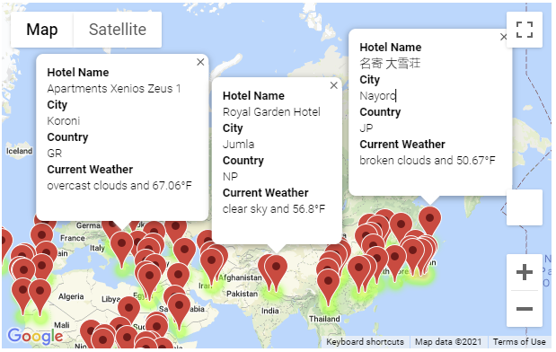

<h1>World Weather Analysis</h1>
This project randomly generated 2000 latitude-longitude pairs and performed an API request for the weather data for the nearest city. The corresponding data was then added to a dataframe, then filtered further based off of the daily maximum temperature for today (50-70 F was used). Then 4 locations were selected and Google Maps API / Directions were used to create driving route through the 4 locations.
</img>
</img>
</img>
